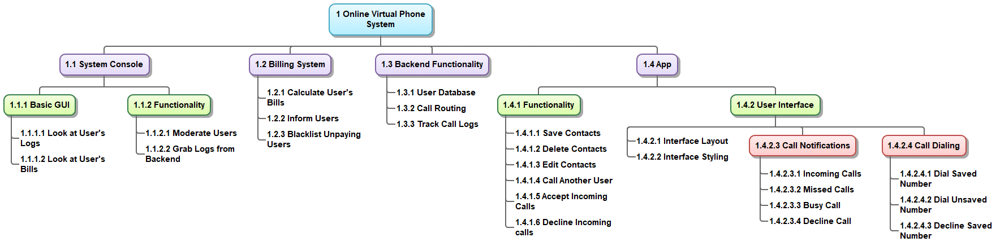
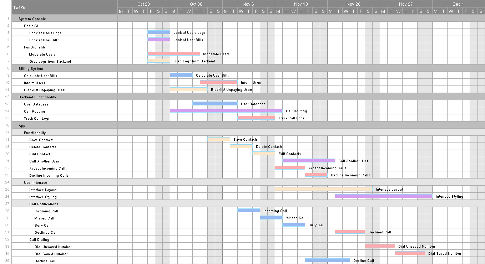
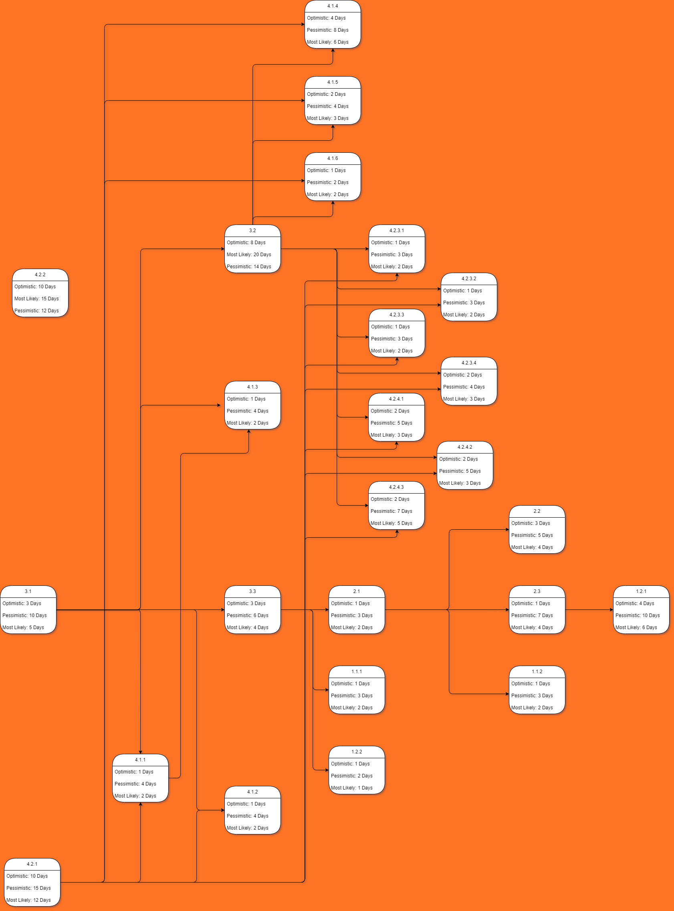
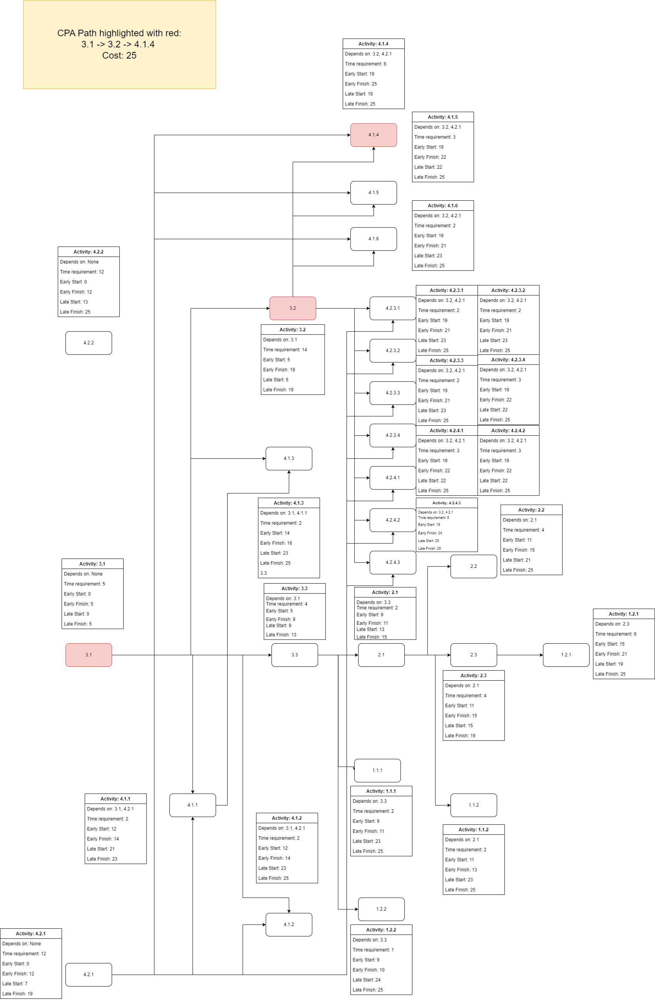

# **ProCaller**

## Project Scheduling

## Version 1.0

## October 24th, 2023

## Wind Falcons

## Revision History

| **Date**     | **Description** | **Author**        | **Comments**                        |
| ------------ | --------------- | ----------------- | ----------------------------------- |
| _10/24/2023_ | _Version 1.0_   | _Ryan Dotzlaw_    | _Initial commit and task breakdown_ |
| _10/24/2023_ | _Version 1.1_   | _Ikram Khan_      | _Added WBS_                         |
| _10/24/2023_ | _Version 1.2_   | _Josh Sigurdson_  | _Added Gantt Chart_                 |
| _10/24/2023_ | _Version 1.3_   | _Khush Patel_     | _Added PERT Chart_                  |
| _10/24/2023_ | _Version 1.5_   | _Andrii Provozin_ | _Added CPA_                         |

**Table of Contents**

- [1. Introduction](#1-introduction)
- [2. Task Breakdown and Resource Identification](#2-task-breakdown)
  - [2.1 Task Breakdown](#21-task-breakdown)
  - [2.2 Resource Identification](#22-resource-identification)
  - [2.3 Time Estimates](#23-time-estimates)
  - [2.4 Task Order](#24-task-order)
- [3. WBS ](#3-wbs)
- [4. Gantt Chart ](#4-gantt-chart)
- [5. PERT Chart ](#5-pert-chart)
- [6.1 CPA Chart ](#6.1-cpa-chart)
- [6.2 CPA Significance ](#6.2-cpa-significance-of-the-critical-path)
- [A. Appendix](#a-appendix)

# 1. Introduction

The purpose of this document is to form a time estimate for the project tasks, and to design a practical project schedule.
This document includes: task breakdown and resource identification, a WBS, a Gantt Chart, a PERT diagram, and a CPA.

The intended audience for this document is the Wind Falcons project team, upper management, and the Pro Caller client(s).

# 2. Task Breakdown and Resource Identification

## 2.1 Task Breakdown

- ProCaller
  1.  System Console
      - 1.1 Basic GUI
        - 1.1.1 Look at Users Logs
        - 1.1.2 Look at Users Bills
      - 1.2 Functionality
        - 1.2.1 Moderate Users
        - 1.2.2 Grab Logs from Backend
  2.  Billing System
      - 2.1 Calculate User Bills
      - 2.2 Inform Users
      - 2.3 Blacklist Unpaying Users
  3.  Backend Functionality
      - 3.1 User Database
      - 3.2 Call Routing
      - 3.3 Track Call Logs
  4.  App
      - 4.1 Functionality
        - 4.1.1 Save Contacts
        - 4.1.2 Delete Contacts
        - 4.1.3 Edit Contacts
        - 4.1.4 Call Another User
        - 4.1.5 Accept Incoming Calls
        - 4.1.6 Decline Incoming Calls
      - 4.2 User Interface
        - 4.2.1 Interface Layout
        - 4.2.2 Interface Styling
        - 4.2.3 Call Notifications
          - 4.2.3.1 Incoming Call
          - 4.2.3.2 Missed Call
          - 4.2.3.3 Busy Call
          - 4.2.3.4 Declined Call
        - 4.2.4 Call Dialing
          - 4.2.4.1 Dial Unsaved Number
          - 4.2.4.2 Dial Saved Number
          - 4.2.4.3 Decline Call

## 2.2 Resource Identification

The Wind Falcons team working on ProCaller consists of 5 people; 1 project manager, and 4 developers.

The developers are: Andrii, Josh, Ryan, and Khush.

The tasks assigned to Andrii are:

- 4.1.1 Save Contacts
- 4.1.2 Delete Contacts
- 4.1.3 Edit Contacts
- 4.2.1 Interface Layout
- 2.3 Blacklist Unpaying Users
- 1.2.2 Grab Logs from Backend

The tasks assigned to Josh are:

- 4.1.4 Call Another User
- 4.2.2 Interface Style
- 3.2 Call Routing
- 1.1.2 Look at User Bills

The tasks assigned to Ryan are:

- 4.1.5 Accept Incoming Calls
- 4.1.6 Decline Incoming Calls
- 4.2.4.1 Dial Unsaved Number
- 4.2.4.2 Dial Saved Number
- 4.2.4.3 Decline Call
- 3.3 Track Call Logs
- 2.2 Inform Users
- 1.2.1 Moderate Users

The tasks assigned to Khush are:

- 3.1 User Database
- 4.2.3.1 Incoming Call
- 4.2.3.2 Missed Call
- 4.2.3.3 Busy Call
- 4.2.3.4 Declined Call
- 2.1 Calculate User Bills
- 1.1.1 Look at Users Logs

# 2.3 Time Estimates

All time measurements are measured in days, assuming a full 8 hour work day.

All time estimates made through consulting an expert.

| Task Number | Task Name                | Optimistic | Pessimistic | Most Likely |
| ----------- | ------------------------ | ---------- | ----------- | ----------- |
| 1.1.1       | Look at User Logs        | 1          | 3           | 2           |
| 1.1.2       | Look at User Bills       | 1          | 3           | 2           |
| 1.2.1       | Moderate Users           | 4          | 10          | 6           |
| 1.2.2       | Grab Logs from Backend   | 1          | 2           | 1           |
| 2.1         | Calculate User Bills     | 1          | 3           | 2           |
| 2.2         | Inform Users             | 3          | 5           | 4           |
| 2.3         | Blacklist Unpaying Users | 1          | 7           | 4           |
| 3.1         | User Database            | 3          | 10          | 5           |
| 3.2         | Call Routing             | 8          | 20          | 14          |
| 3.3         | Track Call Logs          | 3          | 6           | 4           |
| 4.1.1       | Save Contacts            | 1          | 4           | 2           |
| 4.1.2       | Delete Contacts          | 1          | 4           | 2           |
| 4.1.3       | Edit Contacts            | 1          | 4           | 2           |
| 4.1.4       | Call Another User        | 4          | 8           | 6           |
| 4.1.5       | Accept Incoming Calls    | 2          | 4           | 3           |
| 4.1.6       | Decline Incoming Calls   | 1          | 2           | 2           |
| 4.2.1       | Interface Layout         | 10         | 15          | 12          |
| 4.2.2       | Interface Styling        | 10         | 15          | 12          |
| 4.2.3.1     | Incoming Call            | 1          | 3           | 2           |
| 4.2.3.2     | Missed Call              | 1          | 3           | 2           |
| 4.2.3.3     | Busy Call                | 1          | 3           | 2           |
| 4.2.3.4     | Declined Call            | 2          | 4           | 3           |
| 4.2.4.1     | Dial Unsaved Number      | 2          | 5           | 3           |
| 4.2.4.2     | Dial Saved Number        | 2          | 5           | 3           |
| 4.2.4.3     | Decline Call             | 2          | 7           | 5           |

# 2.4 Task Order

#### Independent Tasks:

These tasks can be started at any time, though there may be tasks depending on them.

- 3.1
- 4.2.1
- 4.2.2

#### Finish-to-Start Dependencies:

These tasks depend on the previous task finishing before they can start.

Denoted:
A -> B

Which defines: The successor task 'B' requires the predecessor task 'A' to finish before it can start

| Predecessor | Successor |
| ----------- | --------- |
| 3.1         | 3.2       |
| 3.1         | 3.3       |
| 3.1         | 4.1.1     |
| 3.1         | 4.1.2     |
| 3.1         | 4.1.3     |
| 3.2         | 4.1.4     |
| 3.2         | 4.1.5     |
| 3.2         | 4.1.6     |
| 3.2         | 4.2.3.1   |
| 3.2         | 4.2.3.2   |
| 3.2         | 4.2.3.3   |
| 3.2         | 4.2.3.4   |
| 3.2         | 4.2.4.1   |
| 3.2         | 4.2.4.2   |
| 3.2         | 4.2.4.3   |
| 3.3         | 2.1       |
| 3.3         | 1.1.1     |
| 3.3         | 1.2.2     |
| 2.1         | 2.2       |
| 2.1         | 2.3       |
| 2.1         | 1.1.2     |
| 2.3         | 1.2.1     |
| 4.2.1       | 4.1.1     |
| 4.2.1       | 4.1.2     |
| 4.2.1       | 4.1.4     |
| 4.2.1       | 4.1.5     |
| 4.2.1       | 4.1.6     |
| 4.2.1       | 4.2.3.1   |
| 4.2.1       | 4.2.3.2   |
| 4.2.1       | 4.2.3.3   |
| 4.2.1       | 4.2.3.4   |
| 4.2.1       | 4.2.4.1   |
| 4.2.1       | 4.2.4.2   |
| 4.2.1       | 4.2.4.3   |
| 4.1.1       | 4.1.3     |

# 3 WBS

# 4 Gantt Chart

# 5 PERT

# 6.1 CPA Chart

# 6.2 CPA Significance

A key idea in project management and scheduling is the Critical Path. It is essential for setting the project's schedule, allocating resources, and increasing chances of the project's successful conclusion.

There are number of reasons why it is significant, but the following few explain it the best from my perspective:

- Project length: 
- - The Critical Path allows to get the minimum amount of time that is needed to finish the project. Hence, that allows project managers to set realistic project schedules and make plans that would sound reasonable to stakeholders.

- Resource management:
- - Project managers can make more educated decisions about resources distribution, such as staff and equipment, by analyzing which tasks are on the Critical Path. This leads to allocating more resources to the most important jobs, so that the project can stay within budget and be completed on time.

- Risk management:
- - Identification of potential risks and uncertainties that could change the project's timeline in a negative way becomes easier by having a thorough understanding of the Critical Path. Backup and risk mitigation plans can be arranged in advance to lessen these risks and make sure that the project tasks are being completed according to the previously agreed plan.

Overall, Critical Path is a great tool to have and use for any project manager to meet project deadlines, manage team's resources and avoid less obvious project risks.

# A. Appendix

- [Software Requirements Specification]()
